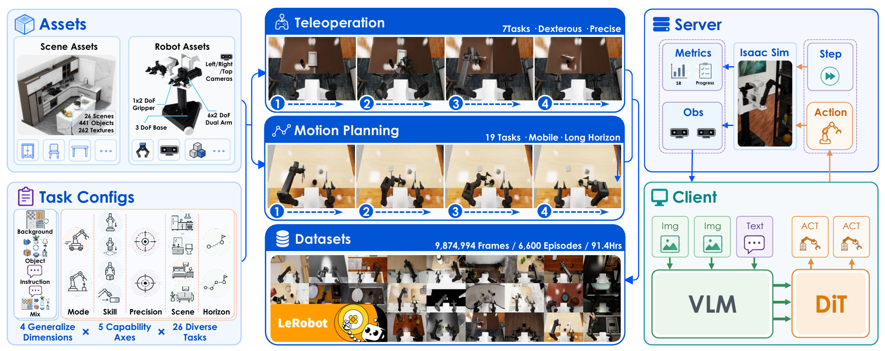
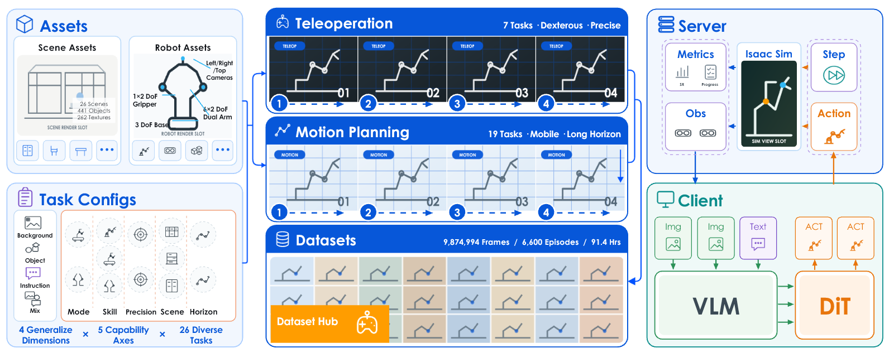

# jandan138 Codex Skills

Public, version-controlled home for reusable Codex skills.

## Skill catalog

| Skill | Purpose | Entry point |
| --- | --- | --- |
| `$build-scientific-figures` | Reconstruct reference-led research figures and create original paper-grounded figures from PDFs, simulation frames, plots, and user assets. | [SKILL.md](.agents/skills/build-scientific-figures/SKILL.md) |

## Included case study

The scientific-figure Skill includes a documented EBench example with the supplied Figure 2
reference screenshot, the user-accepted editable PPTX reconstruction, and a freshly rendered
preview. Start with the
[case-study guide](.agents/skills/build-scientific-figures/references/ebench-case-study.md).

The EBench paper figure is third-party reference material and is not covered by a license for this
repository's original code or templates. See [THIRD_PARTY_NOTICES.md](THIRD_PARTY_NOTICES.md) and
the bundled provenance record before redistributing it.

| Original reference | Accepted editable reconstruction |
| --- | --- |
| [](.agents/skills/build-scientific-figures/assets/examples/ebench/ebench-figure-2-reference.png) | [](.agents/skills/build-scientific-figures/assets/examples/ebench/ebench-reconstructed-template.pptx) |

## Use directly from this repository

Codex discovers repository skills under `.agents/skills`. Clone the repository, start Codex from
the repository root, and invoke the skill explicitly:

```text
$build-scientific-figures

Create an original method figure from paper.pdf and the simulation frames in frames/.
Review the semantic graph before final rendering.
```

## Install for all repositories on Linux

Clone this repository somewhere stable, then link the skill into the user-level skill directory:

```bash
mkdir -p "$HOME/.agents/skills"
ln -s \
  /absolute/path/to/codex-skills/.agents/skills/build-scientific-figures \
  "$HOME/.agents/skills/build-scientific-figures"
```

If a skill with the same name already exists, review it before replacing or relinking it.

## Optional figure-rendering dependencies

The canonical `figure-spec.json` and SVG path needs only Python 3.10+. Probe the environment before
promising derivative formats:

```bash
cd .agents/skills/build-scientific-figures
python3 scripts/check_environment.py --pretty
```

Install optional Python or Node dependencies only in a caller-managed environment:

```bash
python3 -m pip install -r scripts/requirements.txt
npm install --prefix scripts
```

PNG and PDF are generated only through a verified renderer. PPTX is an optional editable
projection; the specification plus canonical SVG remain authoritative.

## Repository policy

- Store each skill at `.agents/skills/<skill-name>/`.
- Keep real papers, private experiment data, generated figures, and temporary QA artifacts out of
  the skill package unless they are intentional, documented fixtures. Third-party reference assets
  require explicit maintainer authorization, provenance, attribution, and a clear reuse boundary.
- Preserve Linux-safe relative paths, UTF-8 text, deterministic scripts, and provenance.
- Validate and forward-test a skill before publishing changes.
